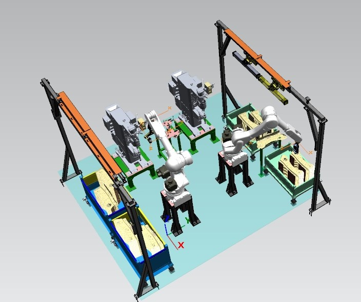
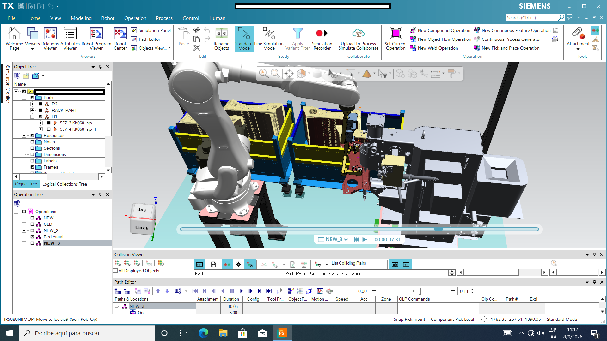

# Technical Report: Virtual Simulation and Robotics in Siemens Tecnomatix Process Simulate

**Author:** Julieta Pérez Echeverría  
**Context:** Engineering Internship Technical Report  
**Platform:** Siemens Tecnomatix Process Simulate  
> **Full Technical Report:** Read the complete engineering documentation in [PDF Format](Technical_Report_Process_Simulate.pdf).
---

## 1. Technical Progression and Context

This repository documents the technical progression and practical application of Siemens Tecnomatix Process Simulate during an engineering internship. The work covers two main development environments:

1. **Independent Testing Environment (`.pzx`):** Focused on platform fundamentals, CAD data management (NX, CATIA, JT), 6-axis KUKA robot setup, Tool Center Point (TCP) calibration, custom mechanism kinematics (Kinematics Editor), and path generation for spot and continuous seam welding.
2. **Commercial Welding Cell Project:** 3D layout optimization and simulation for a dual-robot Kawasaki cell integrated with a 3D vision system and a nut-welding pedestal. Key tasks included CAD integration, Pick & Place sequencing, TCP orientation optimization, and full collision eradication using Collision Pairs to achieve 0% physical interference.


---

## Cell Layout and Simulation Setup

<br />

<div align="center">

  <h3>Cell Layout and Simulation Setup</h3>

  
  <p><em>Figure 1: General 3D layout and resource distribution in Siemens Tecnomatix Process Simulate.</em></p>

  <br />

  
  <p><em>Figure 2: Detail view of the Kawasaki robot holding the workpiece during the nut-welding pedestal approach sequence.</em></p>

</div>

<br />


## 2. Consolidated Technical Skills

### CAD Management and Environment Structuring
* Import, conversion, and conditioning of 3D CAD data from native (NX, CATIA) and neutral (JT, STEP) formats.
* Hierarchical organization of the System Tree, establishing clear segregation between static fixtures, dynamic resources, and workpieces.

### 3D Cell Layout and Reachability Analysis
* Spatial positioning of industrial robots and fixed cell infrastructure.
* Kinematic evaluation to prevent wrist/elbow singularities and joint hyperextensions within critical reach zones.

### Device Kinematics (Kinematics Editor)
* Assembly of custom kinematic chains for auxiliary devices, including rotary tables and clamping mechanisms.
* Definition of links, rotational and prismatic joints, reference frame placement, and joint travel limits.

### Multi-Brand Robotics Integration
* Environment setup and positioning for KUKA and Kawasaki robotic units.
* Creation, vector alignment, and calibration of Tool Center Points (TCPs) for welding guns and handling grippers.

### 3D Path Programming and Optimization
* Generation of routines for spot welding, continuous seam welding, and material handling using the Path Editor.
* Implementation of approach and retract waypoints to prevent collisions during tight geometric entries.

### Dynamic Collision Analysis
* Configuration of Collision Pairs between moving resources and stationary cell structures.
* Iterative waypoint adjustment and tool reorientation to eliminate physical interferences completely.

### Cycle Time Evaluation and Motion Dynamics (RRS)
* Transition from nominal motion execution to vendor-specific motion evaluation using Realistic Robot Simulation (RRS) controllers.
* Takt Time optimization through trajectory tuning: alternating between Joint (PTP) motion for free-space moves and Linear (LIN) motion for process engagement.
* Analysis of velocity profiles, termination criteria (FINE), and corner rounding (Zone/CNT/Fly-by) using the Sequence Editor and Path Editor attribute tables.

---

## 3. Current Focus and Ongoing Learning Objectives

* **Point Matrix Alignment:** Refining frame alignment procedures for direct import of external point data (`.csv` / `.xml`) without spatial offsets.
* **Welding Parameters:** Expanding technical criteria regarding resistance welding parameters (gun opening, squeeze times) and arc welding physical constraints.
* **Advanced RRS Integration:** Deepening realistic controller configurations for accurate, vendor-specific cycle time validation.
* **Logic and Event Synchronization:** Transitioning into signal-based interlocks (DI/DO) between Kawasaki controllers, 3D vision systems, and the welding pedestal.

---

## 4. Repository Contents

```text
├── docs/
│   └── Technical_Report_Process_Simulate.pdf   # Complete LaTeX engineering report
└── README.md
